# UK bank parent-group graph (IN-002)

**Scope:** the 145 workbooks currently present in `banks/`. This is a
relationship map, not a replacement for the reporting-basis notes in each
workbook. A bank's regulatory metrics remain on the basis disclosed by that
bank; group membership does not authorise substituting parent figures.

## Conventions

- `owned_by` is a corporate/legal ownership relationship.
- `ultimate_parent_of` is the inverse lookup edge used for grouping; it is
  included explicitly so downstream tools can query either direction.
- `regulatory_consolidated_into` identifies a prudential/reporting perimeter
  and is deliberately separate from ownership.
- `historical` rows describe a prior or changing relationship and must not be
  treated as current ownership without their effective date.
- `builder-note` means the bank's own source note in `scripts/build_*.py` and
  the generated workbook, which contains the primary filing/report URL used
  for the build. `CH` means Companies House; `AR/P3` means the bank or group
  annual/Pillar 3 report. Rows marked `confirm-later` are intentionally
  conservative: no parent is inferred from the name alone.

## Bank-level lookup

| Bank/legal entity | FRN | Immediate parent or ownership | Ultimate/group node | Status and reporting caveat | Evidence |
|---|---:|---|---|---|---|
| ABC International Bank | 149025 | Bank ABC B.S.C. | Arab Banking Corporation / Bank ABC | confirmed; FY2023–24 consolidated, earlier solo | AR/P3, builder-note |
| Access Bank UK | 478415 | Access Bank Plc | Access Holdings Plc | confirmed; UK entity/group basis varies by year | CH, AR/P3 |
| Afin Bank | 1004742 | WAICA Reinsurance Corporation PLC (majority) | WAICA group | confirmed; standalone bank metrics | AR/P3 |
| AIB Group UK | 122088 | Allied Irish Banks, p.l.c. | AIB Group plc | confirmed; UK Group basis | CH, AR |
| Aldermore | 204503 | Aldermore Group plc | Aldermore Group plc | confirmed; Bank vs Group columns retained | AR/P3 |
| Allica | 821851 | Warwick Capital Partners LLP (25–50%); other institutional investors | Allica group | confirmed non-single-parent/institutional-investor ownership; no single ultimate parent | CH, AR/P3 |
| Alpha Bank London | 135327 | Alpha Bank S.A. | Alpha Bank group | confirmed from 20 Apr 2021; prior Alpha holding-company identities are historical | CH, AR |
| AlRayan Bank | 229148 | AlRayan Bank Q.P.S.C. | AlRayan Bank Q.P.S.C. | confirmed; UK entity basis | CH, AR |
| Arab Bank Europe | 446951 | Arab Bank plc | Arab Bank Group | confirmed; UK entity basis | AR, builder-note |
| Arbuthnot Latham | 143336 | Arbuthnot Banking Group plc | Arbuthnot Banking Group plc | confirmed; Bank Group cash flow, ABG P3 caveat | AR/P3 |
| Atom Bank | 661960 | Atom Holdco plc (from FY2023) | Atom group | confirmed; parent inserted during series | AR/P3 |
| Bank Mandiri Europe | 204424 | PT Bank Mandiri (Persero) Tbk | Bank Mandiri group | confirmed; UK entity basis | CH, AR |
| Bank of Africa UK | 454750 | Bank of Africa S.A. | Bank of Africa / BMCE group | confirmed; former BMCE/MediCapital names | CH, P3 |
| Bank of Beirut UK | 219523 | Bank of Beirut SAL | Bank of Beirut group | confirmed; UK entity basis | CH, AR |
| Bank of Ceylon UK | 514744 | Bank of Ceylon | Bank of Ceylon group | confirmed; UK entity basis | CH, AR |
| Bank of China UK | 467410 | Bank of China Limited | Bank of China group | confirmed; state-owned parent | CH, P3 |
| Bank of Ireland UK | 512956 | Bank of Ireland Group plc | Bank of Ireland group | confirmed; consolidated UK Group basis | AR |
| Bank of Scotland | 169628 | Lloyds Banking Group plc | Lloyds Banking Group | confirmed; distinct legal bank, Bank-only P3 basis | CH, AR |
| Bank of the Philippine Islands Europe | 455378 | Bank of the Philippine Islands | BPI group | confirmed; distinct from PNB Europe | CH, P3 |
| Bank Saderat | 204488 | Bank Saderat Iran | Bank Saderat Iran group | confirmed; UK entity basis | CH, AR |
| Bank Sepah International | 208019 | Bank Sepah | Bank Sepah group | confirmed; EUR source converted to GBP | CH, AR |
| Barclays Bank UK | 759676 | Barclays plc | Barclays Bank UK Group / Barclays plc | confirmed; ring-fenced subgroup, not wider Barclays Group | P3, builder-note |
| Barclays Bank PLC | 122702 | Barclays plc | Barclays plc | confirmed; non-ring-fenced entity/group, distinct from Barclays UK | CH, AR |
| Birmingham Bank | 204478 | Better Home and Finance Holding Company | Better Home and Finance group | confirmed from 22 Dec 2025; pre-acquisition period had no registrable parent | CH, P3 |
| BLME | 464292 | Boubyan Bank | Boubyan / BLME group | confirmed; standalone BLME P3, not wider holdings | P3 |
| BNY Mellon International | 183100 | The Bank of New York Mellon Corporation | BNY Mellon group | confirmed; entity-level figures | P3, AR |
| British Arab Commercial Bank | 204564 | Libyan Foreign Bank (85.95%) plus two minority state-bank owners | BACB consortium | confirmed consortium; no single parent | P3 |
| Brown Shipley | 124548 | Quintet Private Bank (Europe) S.A. | Quintet group | confirmed; entity-level cash flow | CH, AR |
| C. Hoare & Co. | 122093 | Hoare family | C. Hoare & Co. | confirmed private/family ownership; no corporate parent | P3, AR |
| CAF Bank | 204451 | Charities Aid Foundation | CAF group | confirmed; own basis | CH, AR |
| Cambridge & Counties Bank | 579415 | Trinity Hall and Cambridgeshire County Council (joint) | CCB joint ownership | confirmed; no subsidiaries | P3 |
| Castle Trust Capital | 541910 | Castle Trust Holdings Limited | Castle Trust group | confirmed; solo bank figures | CH, AR |
| Cater Allen | 178737 | Santander Private Banking UK → Santander UK plc | Banco Santander S.A. | confirmed; intermediate chain retained | CH, AR |
| Charity Bank | 207701 | none identified | Charity Bank | confirmed standalone UK-owned entity | AR |
| Charter Court Financial Services | 494549 | OneSavings Bank plc from 2025; historically CCFSG Holdings | OSB Group | confirmed; direct parent changed | CH, AR |
| Chetwood Bank | 740551 | Chetwood Financial Limited | Chetwood group | confirmed; FY2021 solo, later Group | P3, AR |
| Citibank UK | 805574 | none; Citibank UK Limited | Citibank UK Limited | confirmed standalone reporting entity; distinct from Citi branches | P3, AR |
| ClearBank | 754568 | Clearbank Group Holdings Limited | CB Growth Holdings Limited / ClearBank group | confirmed chain from 8 Dec 2023 | CH, AR/P3 |
| Close Brothers | 124750 | Close Brothers Group plc (wider listed parent) | Close Brothers group | confirmed; workbook uses Close Brothers Limited Group | CH, AR/P3 |
| Clydesdale Bank | 121873 | Nationwide Building Society currently; Virgin Money UK historically | Nationwide group (current) | historical change; FY2025 transition period | P3, AR |
| Co-operative Bank | 121885 | Coventry Building Society from 1 Jan 2025; Co-op Holdings historically | Coventry group (current) | acquisition effective date matters; 2024 still prior perimeter | P3, AR |
| Coutts & Company | 122287 | NatWest Group plc / NatWest Holdings | NatWest Group | confirmed; entity basis, ring-fenced subgroup caveat | CH, AR |
| Credit Suisse International | 146702 | UBS Group AG; Credit Suisse Group historically | UBS group (current) | acquisition/wind-down transition | CH, AR/P3 |
| Credit Suisse UK | 124269 | UBS Group AG; Credit Suisse Group historically | UBS group (current) | acquisition and 2025 Part VII transfer | CH, AR |
| Crown Agents Bank | 204456 | CAB Payments Holdings plc | CAB Payments group | confirmed; bank-solo workbook basis | P3 |
| Cynergy Bank | 575105 | Cynergy Capital-led consortium | Cynergy group | confirmed; former Bank of Cyprus UK | AR |
| DB UK Bank | 140848 | Deutsche Holdings Limited → Deutsche Bank AG | Deutsche Bank group | confirmed chain; UK entity basis | CH, AR |
| DF Capital Bank | 848291 | Distribution Finance Capital Holdings plc | DF Capital group | confirmed; Group consolidated | P3 |
| EFG Private Bank | 144036 | EFG International AG | EFG International group | confirmed; UK statutory entity data | AR |
| FCE Bank | 204469 | Ford ECO GmbH → Ford Credit/FMCC | Ford Motor Company group | confirmed; parent transaction caveat in 2024 | AR |
| FCMB UK | 502704 | FCMB Limited → FCMB Group Plc | FCMB group | confirmed; UK entity figures | AR, group subsidiary list |
| FidBank UK | 400712 | Fidelity Bank Plc | Fidelity Bank group | confirmed; wholly owned, UK-only figures | AR |
| FirstBank UK | 216772 | First Bank of Nigeria Limited | FirstBank group | confirmed; formerly FBN Bank UK; 2022 FX restatement | AR |
| Gatehouse Bank | 475346 | Gatehouse Financial Group Limited | KIA / Securities House-controlled Gatehouse group | confirmed; consolidated Gatehouse figures | AR/P3 |
| GB Bank | 850286 | individual/local-authority controllers; no corporate parent | GB Bank | confirmed standalone/non-single-parent ownership; SilverRock is separate regulatory scope | CH, P3 |
| Ghana International Bank | 204471 | Government of Ghana | Ghana International Bank | confirmed state-owned; no subsidiaries | AR |
| Goldman Sachs International Bank | 124659 | Goldman Sachs International / GSG UK | The Goldman Sachs Group, Inc. | confirmed; GSIB breakout within GSG UK disclosure | P3 |
| Griffin Bank | 970920 | none identified; no registrable parent statement | Griffin Bank | confirmed standalone/non-single-parent ownership | CH, AR/P3 |
| Guaranty Trust Bank UK | 466611 | Guaranty Trust Bank Limited Nigeria | GTCO Plc | confirmed chain; UK entity figures | CH, AR |
| Gulf International Bank UK | 124772 | Gulf International Bank B.S.C. | GIB group | confirmed; UK standalone accounts | CH, AR |
| Habib Bank Zurich | 627671 | Habib Bank AG Zurich | Habib Bank Zurich group | confirmed; immediate = ultimate parent | AR |
| Hampden & Co | 606934 | no overall controlling party | Hampden & Co. | confirmed standalone; investors are not a parent | AR |
| Hampshire Trust Bank | 204601 | Hoggant Limited | ASO-managed funds / HTB group | confirmed; Bank cash flow vs Group liquidity basis | AR |
| Handelsbanken | 806852 | Svenska Handelsbanken AB (publ.) | Handelsbanken group | confirmed; UK Group figures | AR |
| Havin Bank | 204481 | Banco Central de Cuba (majority) | Cuban state-bank group | confirmed controlling parent; minority state-bank interests | CH, AR |
| HBL Bank UK | 188585 | Habib Allied Holding → Habib Bank Limited | Aga Khan Fund / HBL group | confirmed chain; UK-only metrics | P3 |
| HSBC Bank plc | 114216 | HSBC Holdings plc | HSBC group | confirmed; legacy non-ring-fenced entity | AR/P3 |
| HSBC Innovation Bank | 543146 | HSBC UK Bank plc / HSBC Holdings plc | HSBC group | confirmed; former Silicon Valley Bank UK | AR/P3 |
| HSBC UK Bank plc | 765112 | HSBC Holdings plc via HSBC UK subgroup | HSBC group | confirmed; ring-fenced entity, distinct from HSBC Bank plc | AR/P3 |
| ICBC (London) plc | 222030 | Industrial and Commercial Bank of China Limited | ICBC group | confirmed; UK solo basis | AR/P3 |
| ICBC Standard Bank plc | 124823 | ICBC (60%) and Standard Bank Group (40%) | ICBC Standard Bank JV | confirmed joint venture; separate from ICBC London | AR |
| ICICI Bank UK | 223268 | ICICI Bank Limited | ICICI group | confirmed wholly owned; UK entity basis | CH, bank site |
| iFAST Global Bank | 716167 | iFAST UK Holdings → iFAST Corporation Limited | iFAST group | confirmed | AR |
| Investec Bank | 172330 | Investec plc | Investec group | confirmed dual-listed structure | AR |
| Itaú BBA International | 575225 | Itaú Unibanco Holding S.A. | Itaú group | confirmed | AR |
| Jordan International Bank | 183722 | Housing Bank for Trade and Finance (75%) and Arab Jordan Investment Bank (25%) | JIB joint ownership | confirmed two-parent structure; no single parent | bank governance |
| J.P. Morgan Europe | 124579 | J.P. Morgan Capital Holdings → JPMorgan Chase & Co. | JPMorgan Chase group | confirmed; distinct legal entity from JPMS | AR |
| J.P. Morgan Securities | 155240 | JPMorgan Chase Bank, N.A. | JPMorgan Chase group | confirmed; distinct from JPM Europe | AR |
| Julian Hodge Bank | 204439 | Hodge Limited | The Carlyle Trust (Jersey) Limited | confirmed private chain | AR |
| KEXIM Bank UK | 204490 | Export-Import Bank of Korea | KEXIM / Korean state group | confirmed wholly owned | AR |
| Kingdom Bank | 400972 | Lamb’s Passage Holding Limited | Kingdom group | confirmed; Stewardship is investor, not parent | bank oversight |
| Kroo Bank | 953772 | none identified; individual control | Kroo Bank | conservative standalone; no corporate parent | CH, AR |
| Kuwait Finance House | 131818 | Kuwait Finance House Group; Ahli United Bank UK historically | Kuwait Finance House group | historical conversion/ownership change in 2024 | bank site |
| LHV Bank | 993767 | AS LHV Group | LHV group | confirmed Estonian parent | AR |
| Lloyds Bank | 119278 | Lloyds Banking Group plc | Lloyds Banking Group | confirmed; distinct from Bank of Scotland and LBCM | CH, AR |
| Lloyds Bank Corporate Markets | 763256 | Lloyds Banking Group plc | Lloyds Banking Group | confirmed; non-ring-fenced subgroup | group ring-fencing page |
| Marks and Spencer Financial Services | 151427 | HSBC UK Bank plc | HSBC group | confirmed; HSBC UK controls; entity remains distinct | CH, HSBC page |
| Melli Bank | 207380 | Bank Melli Iran | Bank Melli Iran / Iranian state | confirmed; UK standalone figures | CH, bank compliance |
| Methodist Chapel Aid | 204508 | none identified | Methodist Chapel Aid | conservative standalone; church relationship is not a corporate parent | CH |
| Metro Bank | 488982 | Metro Bank Holdings plc from 19 May 2023; Metro Bank plc before | Metro Bank group | historical parent insertion | AR |
| Mizuho International | 119256 | Mizuho Securities Co. → Mizuho Financial Group | Mizuho group | confirmed chain | AR |
| Monument Bank | 849724 | none identified; no registrable parent statement | Monument Bank group (internal reporting group only) | confirmed standalone/non-single-parent ownership | CH, AR/P3 |
| Monzo | 730427 | Monzo Bank Holding Group Limited from Apr 2023 | Monzo group | historical holding-company insertion | AR |
| Morgan Stanley Bank International | 195430 | Morgan Stanley Investments (UK) → Morgan Stanley | Morgan Stanley group | confirmed | CH, P3 |
| National Bank of Egypt UK | 204520 | National Bank of Egypt | NBE group | confirmed | AR/CH |
| National Bank of Kuwait International | 171532 | National Bank of Kuwait | NBK group | confirmed | AR/CH |
| National Westminster Bank | 121878 | NatWest Group plc | NatWest group | confirmed; DoLSub liquidity with RBS/Coutts | AR, CH |
| NatWest Markets | 121882 | NatWest Group plc | NatWest group | confirmed; distinct investment-bank entity | AR |
| Nomura Bank International | 204419 | Nomura Europe Holdings | Nomura group | confirmed | AR/CH |
| Northern Bank | 122261 | Danske Bank A/S | Danske Bank group | confirmed | AR/CH |
| OakNorth Bank | 629564 | OakNorth Bank Group | OakNorth group | confirmed internal group; no external parent | AR |
| OneSavings | 530504 | OSB Group plc | OSB group | confirmed | AR/CH |
| Oxbury | 834822 | Oxfield Limited (from 16 May 2025); Oxbury plc historically | Oxbury group | historical parent change | CH, AR |
| Paragon | 604551 | Paragon Banking Group plc | Paragon group | confirmed | AR/CH |
| Perenna | 956138 | Perenna Group Limited | Perenna group | confirmed | AR |
| Persia International Bank | 208020 | Bank Mellat (60%) and Bank Tejarat (40%) | Persia joint ownership | confirmed two-parent structure; no single parent | bank governance |
| Philippine National Bank Europe | 204532 | Philippine National Bank | PNB group | confirmed | AR/CH |
| Punjab National Bank International | 459701 | Punjab National Bank | PNB India group | confirmed | AR/CH |
| QIB UK | 466577 | Qatar Islamic Bank S.A.Q. | QIB group | confirmed | AR/CH |
| Rathbones Investment Management | 116316 | Rathbones Group plc | Rathbones group | confirmed | AR/CH |
| RBC Europe | 124543 | Royal Bank of Canada | RBC group | confirmed | AR |
| RBS | 114724 | NatWest Group plc | NatWest group | confirmed; distinct post-2018 legal lineage; DoLSub caveat | AR/CH |
| RCI Bank UK | 815220 | RCI Financial Services → Mobilize Financial Services/Renault | Renault group | confirmed chain; group rebrand | AR |
| Recognise Bank | 849404 | none currently identified | Recognise Bank | conservative standalone; historical City of London/Parasol links | AR/CH |
| Redwood Bank | 755924 | Redwood Financial Partners | Redwood group | confirmed | AR |
| Reliance Bank | 204537 | Salvation Army structure | Salvation Army group | confirmed charitable ownership; not ordinary corporate parent | AR/CH |
| Santander Financial Services | 146003 | Santander UK Group Holdings plc | Banco Santander S.A. | confirmed; standalone SFS accounts | AR |
| Santander UK | 106054 | Santander UK Group Holdings plc | Banco Santander S.A. | confirmed; RFB Group basis | AR/P3 |
| Schroder | 144206 | Schroders plc/group | Schroders group | confirmed; standalone company figures | AR |
| Secure Trust Bank | 204550 | Secure Trust Bank plc | Secure Trust group | confirmed; Group cash flow/P3 | AR/P3 |
| Shawbrook | 204574 | Shawbrook Group plc | Shawbrook group | confirmed; FY2025 Group-only P3 caveat | P3 |
| SMBC | 223304 | Sumitomo Mitsui Banking Corporation | SMBC / Sumitomo Mitsui Financial Group | confirmed | AR/P3 |
| Standard Chartered Bank | 114276 | Standard Chartered plc | Standard Chartered group | confirmed | AR/P3 |
| Starling | 730166 | Starling Group Holdings Limited from 2025; prior SBL structure | Starling group | historical holding-company insertion | AR |
| State Bank of India UK | 757156 | State Bank of India | SBI group | confirmed wholly owned; UK standalone metrics | AR/P3 |
| StreamBank | 954876 | none identified | StreamBank | conservative standalone; no subsidiaries | AR |
| Tandem | 204479 | Tandem Money Limited | Tandem group | confirmed; cash flow solo, P3 Group | AR/P3 |
| TD Bank Europe | 165556 | TD Bank, N.A. / Toronto-Dominion Bank | TD group | confirmed | AR/P3 |
| The Bank of London Group | 930379 | Oplyse Holdings Limited; historical Bank of London Group Holdings | Bank of London/Oplyse group | historical parent/name change; regulatory notice caveat | PRA notice, AR |
| This Bank | 832786 | none identified | This Bank | conservative standalone; entity-level accounts | AR |
| Triodos | 817008 | Triodos Bank N.V. | Triodos group | confirmed; UK entity-level figures | AR |
| TSB | 191240 | TSB Banking Group plc → Banco de Sabadell, S.A. (through FY2025) | Sabadell group (historical) | Santander acquisition announced, not effective at FY2025 | AR/P3 |
| Turkish Bank UK | 204566 | Turkish Bank Ltd / Turkish Bank group | Turkish Bank group | confirmed | AR/CH |
| UBA UK | 695048 | United Bank for Africa Plc | UBA group | confirmed | AR |
| Union Bancaire Privée UK | 119250 | UBP (UK) Ltd / Swiss UBP group | Union Bancaire Privée group | confirmed; UK consolidation group scope | AR/P3 |
| Union Bank of India UK | 601551 | Union Bank of India | Union Bank of India group | confirmed | AR/CH |
| United National | 207381 | Bestway Group Financial Services from Jul 2024; UBL/NBP historically | Bestway group (current) | historical ownership change; 95.1% acquisition | AR |
| United Trust Bank | 204463 | UTB Partners plc | UTB Partners group | confirmed; consolidated P3, not solo | AR/P3 |
| Unity Trust | 204570 | none; mixed institutional ownership | Unity Trust Bank | confirmed no ultimate parent; extended entity basis | AR |
| Vanquis | 221156 | Vanquis Banking Group plc | Vanquis group | confirmed; Group P3 includes subsidiaries | P3 |
| Vida | 738741 | Vida Group Holdings plc | Vida group | confirmed; Group P3 | AR/P3 |
| Weatherbys | 204571 | Weatherbys Banking Group | Weatherbys group | confirmed; Group/Solo disclosures | AR/P3 |
| Zempler | 671140 | none identified; prior group no longer exists | Zempler Bank | conservative standalone; group restructuring caveat | AR |
| Zenith | 451720 | Zenith Bank Plc Nigeria | Zenith group | confirmed | AR |
| Zopa | 800542 | Zopa Group plc/Limited | Zopa group | confirmed; Bank and Group reporting bases separated | AR/P3 |

## Typed edge list

The following is the compact graph input. `source` points to the evidence
class in the lookup above; the detailed primary URLs remain in the cited
workbook source notes and the linked official documents used during the
build. Dates are omitted where the relationship is stable over the window.

| from | edge | to | effective / note | source |
|---|---|---|---|---|
| HSBC UK Bank plc | owned_by | HSBC Holdings plc | current | AR/P3 |
| HSBC Bank plc | owned_by | HSBC Holdings plc | current | AR/P3 |
| HSBC Innovation Bank Ltd | owned_by | HSBC UK Bank plc | current; former SVB UK | AR/P3 |
| M&S Financial Services plc | regulatory_consolidated_into | HSBC UK Bank plc | current P3 perimeter | CH, HSBC |
| Lloyds Bank plc | owned_by | Lloyds Banking Group plc | current | CH, AR |
| Bank of Scotland plc | owned_by | Lloyds Banking Group plc | current | CH, AR |
| Lloyds Bank Corporate Markets plc | owned_by | Lloyds Banking Group plc | current | CH, AR |
| National Westminster Bank plc | owned_by | NatWest Group plc | current | AR, CH |
| NatWest Markets plc | owned_by | NatWest Group plc | current | AR |
| RBS plc | owned_by | NatWest Group plc | current; post-2018 legal lineage | AR, CH |
| Coutts & Company | owned_by | NatWest Group plc | current | CH, AR |
| RBS plc | regulatory_consolidated_into | UK DoLSub | liquidity scope | AR |
| National Westminster Bank plc | regulatory_consolidated_into | UK DoLSub | liquidity scope | AR |
| Coutts & Company | regulatory_consolidated_into | UK DoLSub | liquidity scope | AR |
| J.P. Morgan Europe Ltd | owned_by | J.P. Morgan Capital Holdings Ltd | current | AR |
| J.P. Morgan Securities plc | owned_by | JPMorgan Chase Bank N.A. | current | AR |
| J.P. Morgan Capital Holdings Ltd | owned_by | JPMorgan Chase & Co. | current | AR |
| ICBC Standard Bank plc | owned_by | ICBC Limited | 60% JV | AR |
| ICBC Standard Bank plc | owned_by | Standard Bank Group | 40% JV | AR |
| Credit Suisse International | owned_by | UBS Group AG | current; Credit Suisse historical | AR, CH |
| Credit Suisse UK | owned_by | UBS Group AG | current; Credit Suisse historical | AR, CH |
| Metro Bank plc | owned_by | Metro Bank Holdings plc | from 2023-05-19 | AR |
| Metro Bank Holdings plc | ultimate_parent_of | Metro Bank plc | from 2023-05-19 | AR |
| Kuwait Finance House plc | owned_by | Kuwait Finance House Group | from 2024 conversion | bank site |
| Oxbury Bank plc | owned_by | Oxfield Limited | from 2025-05-16 | CH, AR |
| Monzo Bank Ltd | owned_by | Monzo Bank Holding Group Ltd | from 2023-04 | AR |
| Co-operative Bank plc | owned_by | Coventry Building Society | from 2025-01-01 | AR |
| Clydesdale Bank plc | owned_by | Nationwide Building Society | current; Virgin Money UK historical | AR |
| TSB Bank plc | regulatory_consolidated_into | TSB Banking Group plc | FY2021–FY2025 | AR/P3 |
| TSB Banking Group plc | owned_by | Banco de Sabadell, S.A. | through FY2025; sale to Santander pending | AR/P3 |
| United National Bank Ltd | owned_by | Bestway Group Financial Services Ltd | from 2024-07 | AR |
| Allica Bank Ltd | owned_by | Warwick Capital Partners LLP | current; 25–50% PSC, no single ultimate parent | CH |
| Alpha Bank London Ltd | owned_by | Alpha Bank S.A. | from 2021-04-20 | CH |
| Birmingham Bank Ltd | owned_by | Better Home and Finance Holding Company | from 2025-12-22; prior no-parent state retained | CH |
| ClearBank Ltd | owned_by | Clearbank Group Holdings Ltd | from 2023-12-08 | CH, AR |
| Clearbank Group Holdings Ltd | owned_by | CB Growth Holdings Ltd | current | AR |

## Mermaid multi-bank cluster views

```mermaid
graph TD
  HSBC[HSBC Holdings plc] --> HSB[HSBC Bank plc]
  HSBC --> HUK[HSBC UK Bank plc]
  HUK --> HSI[HSBC Innovation Bank Ltd]
  HUK -. regulatory consolidation .-> MS[M&S Financial Services plc]

  LBG[Lloyds Banking Group plc] --> LB[Lloyds Bank plc]
  LBG --> BOS[Bank of Scotland plc]
  LBG --> LBCM[Lloyds Bank Corporate Markets plc]

  NW[NatWest Group plc] --> NWM[NatWest Markets plc]
  NW --> NWB[National Westminster Bank plc]
  NW --> RBS[Royal Bank of Scotland plc]
  NW --> COUTTS[Coutts & Company]

  JPM[JPMorgan Chase & Co.] --> JPMC[J.P. Morgan Capital Holdings Ltd]
  JPMC --> JPME[J.P. Morgan Europe Ltd]
  JPM --> JPMS[J.P. Morgan Securities plc]

  UBS[UBS Group AG] --> CSI[Credit Suisse International]
  UBS --> CSUK[Credit Suisse UK]

  ICBC[ICBC Limited] --> ICBS[ICBC Standard Bank plc]
  SBG[Standard Bank Group] --> ICBS
  ICBC --> ICBCUK[ICBC London plc]

  SANT[Banco Santander S.A.] --> SUG[ Santander UK Group Holdings plc]
  SUG --> SANTUK[ Santander UK plc]
  SUG --> SFS[ Santander Financial Services plc]
```

## Quality and follow-up

- Confirmed group/ownership: 122 rows; confirmed standalone, joint,
  consortium, or other non-single-parent ownership: 23 rows; provisional:
  0. Follow-up primary-source research resolved all seven formerly provisional
  cases without inferring a parent solely from a bank name.
- Historical changes are explicitly time-bounded for Metro, Kuwait Finance
  House, Monzo, Oxbury, Co-operative Bank, Clydesdale, United National, TSB,
  Credit Suisse and the holding-company insertions in Atom/Starling.
- The map keeps legal ownership separate from reporting scope. Examples are
  the UK DoLSub for NatWest entities, HSBC UK's inclusion of M&S for a
  regulatory perimeter, TSB Banking Group reporting, and Group-vs-Bank bases
  in Tandem, Secure Trust, Vida and Vanquis.
- No rows remain marked `confirm-later`. IN-004 may use the confirmed
  clusters now, while preserving the historical dates and non-single-parent
  ownership caveats in the lookup and edge list.
